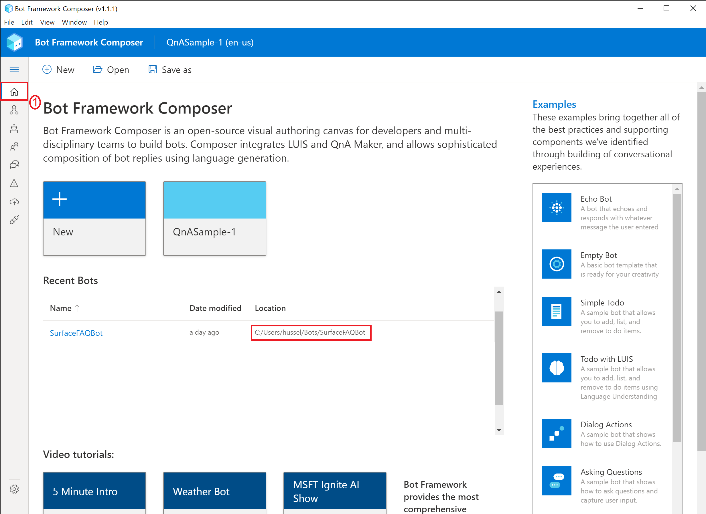
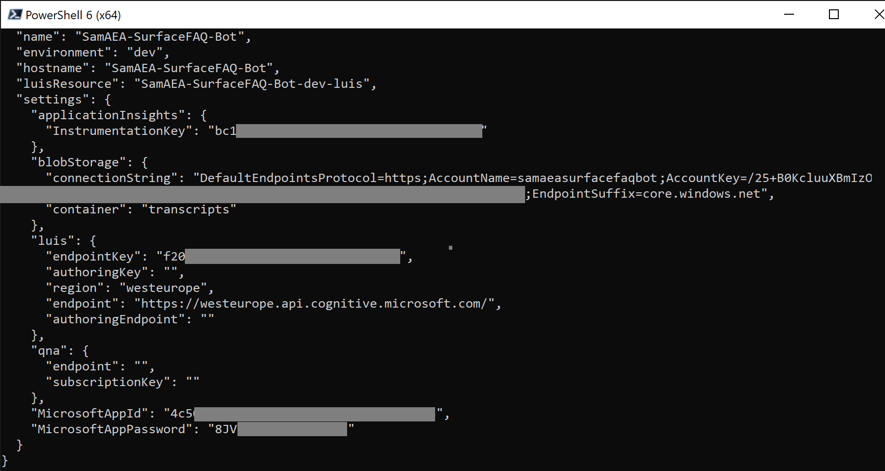
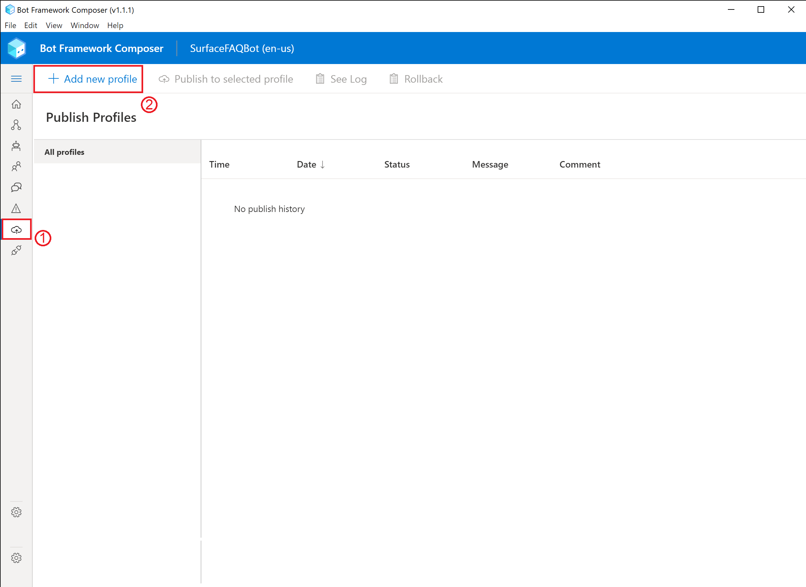
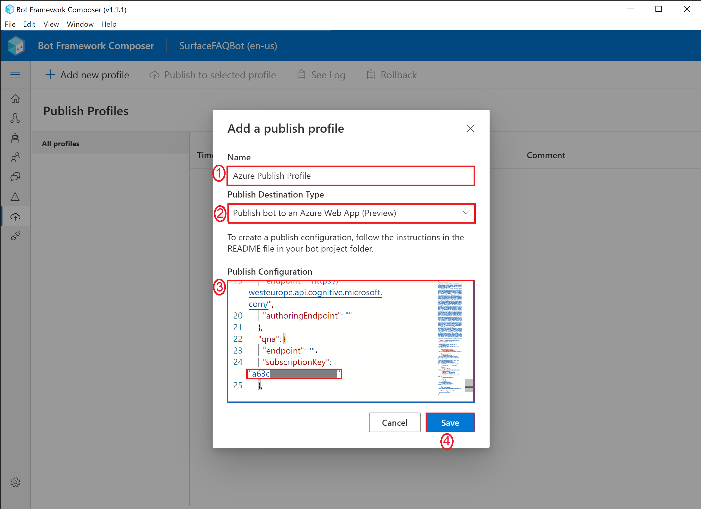

# Azure Surface FAQ Bot Workshop
**Welcome to the one and only Surface FAQ Workshop**

The following guide will help you develop step by step your own FAQ bot without the need of any code experience. We will use the [Bot Framework Composer](https://docs.microsoft.com/en-us/composer/introduction), which is a open-source visual authoring canvas for developers and multidisciplinary teams to build bots. By the end of the workshop, you would have created a bot capable of receiving and describing an image of your choice using Azure AI Cognitive Services.

- **From an architectural perspective, the following Azure services are being used:**
  -  Web App
  -  Storage account
  -  App Service
  -  **Azure Cognitive Services:**
      - QnAMaker

## Prerequisites

> It's important to ensure all of the following prerequisites are met:-

1. An Azure subscription
1. [Bot Framework Composer v1.1.1](https://github.com/microsoft/BotFramework-Composer/releases/download/v1.1.1/BotFramework-Composer-1.1.1-windows-setup.exe)
1. [Bot Framework Emulator](https://github.com/Microsoft/BotFramework-Emulator/releases). 
1. [Azure CLI](https://aka.ms/installazurecliwindows)
1. [NodeJS](https://nodejs.org/en/download/)

      ***NOTE**:- Please take notice of the Bot Framework Composer version number and ensure that version is being used for this lab*


## Overview of the Bot Framework Composer
Bot Framework Composer is an open-source, visual authoring canvas for developers and multi-disciplinary teams to design and build conversational experiences with Language Understanding and QnA Maker, and a sophisticated composition of bot replies (Language Generation). Within this tool, you'll have everything you need to build a sophisticated conversational experience.

- A visual editing canvas for conversation flows
- In context editing for language understanding (NLU)
- Tools to train, test and manage language understanding (NLU) and QnA components
- Language generation and templating system
- A ready-to-use bot runtime executable

## Let's begin!

### 1. Deploying QnAMaker in Azure
  
  We will first provision our QnAMaker instance in the cloud ready to be consumed by the Bot Framework Composer.

  1. Navigate over https://ms.portal.azure.com/#create/Microsoft.CognitiveServicesQnAMaker, sign in to the Azure portal (**using the correct account**) and create a QnA Maker resource.
  1. Select **Create** after you read the terms and conditions:
  
      
  
  1. Fill in the respective fields:-
     - **Resource Group** select your desired resource group you would like to deploy QnAMaker to
     - **Name** give it a unique name. You could use your resouce group name appended by -qna. For example, **YOURRESOURCEGROUPNAME-qna**
     - **Pricing tier** set it to **Standard S0 ($10 per month for unlimited documents, 3 transactions...)**
     - **Azure Search Location** set it to **West Europe**
     - **Azure Search pricing tier** set it to **Free F (3 Indexes)**
     - **App name** set it to the same value as **Name**. For example, **YOURRESOURCEGROUPNAME-qna**
     - **Website location** set to **West Europe**
     - **App insights location** set to **West Europe**
     - Click on **Review + create** and then **Create**

        

  1. Upon successful deployment of QnAMaker:-
     - Click on **Go to resource**
        
        
     - Click on **Keys and Endpoint**
     - Click on **Show Keys**
     - **Take note** of **Key1**, which is our authoring key. For example, copy it to notepad or Word.
        

### 1. Building our Surface FAQ Bot locally!

  We will now begin to build out our FAQ bot locally and publish it to Azure later, when we wish to connect to our bot through channels such as Microsoft Teams. Bot Framework Composer integrates with QnAMaker without needing to create it through the qnamaker.ai portal.

  1. **Open** the Bot Framework Composer application by searching through it in the start menu
  
      
       
  1. Let's create a new Bot Framework Composer Project
  
     - Click on **New**
     - **Create from Knowledge base (QnAMaker)**
     - Click on **Next**

      

     - Select the **Name** field and name your bot e.g. **SurfaceFAQBot**
     - Click on **Next**

      

     - Under **URL** input the following URL **https://www.windowscentral.com/surface-pro-6-faq**. This is just a random FAQ website I found for Surface FAQs
     - Click on **Create knowledge base**
     > A knowledge base consists of question and answer pairs. This can be brought manually or by public URLs and files (PDF, docx, etc). Once defined, QnAMaker will crawl the destination source and automatically extract the pair of questions and answers from it. For more information on different content-types supported by QnAMaker, please visit [here](https://docs.microsoft.com/en-us/azure/cognitive-services/qnamaker/concepts/content-types).

      

  1. From the previous step, you should have seen questions and answers being populated by QnAMaker from the URL we gave it. Let's add our own question and answer into QnAMaker 
     - Click on **SurfaceBotFaq**
     - Click on **Add QnA Pair**
     - For the **question**, type in **What is your name?** and for the **answer** type in **My name is FAQ. Surface FAQ Bot**
     - Click on the **Settings** cogwheel, located on the bottom left corner of the screen.

      

  1. Let's configure Bot Framework Composer project/bot to point to the QnAMaker instance we deployed in Azure and then run our bot.

     - Click on **Start Bot** located on the top right hand corner.
     - For the **QNA Subscription key** field, input your QnAMaker authoring key obtained in the previous steps.
     - Click on **OK**

      


  1. Time to test our bot locally using the Emulator!
     - Click on **Test in Emulator** , right next to the **Restart Bot** button, which was previously called **Start Bot**
     - Speak to the bot by asking it similar questions to the ones we populated earlier.

      
  >Well done, you've successfully created a bot locally that leverages QnAMaker in the cloud to provide FAQ answers based on the data we trained it with.


### 2. Deploy our bot to Azure
  >In order to speak with our bot outside of our over channels such as Teams
  1. Find out the location of your bot by clicking on the **Home** icon and reviewing the **Location** column. E.g. C:\Users\hussel\Bots\SurfaceFAQBot

       

  1. We will also need to know the Azure Subscription Id of the subscription we will deploy our bot to:-

      - Switch back to the browser where you have the Azure Portal already logged OR navigate to https://portal.azure.com
      - In the Search Bar type in **Subscriptions** and click on **Subscriptions** from the dropdown menu
      - Find your subscription you want to use and take note of the **Subscription Id**, you will need this in the next step.

         
           

  1. Now we will open PowerShell to run Bot Framework Composer scripts to deploy your bot solution to Azure.

      - Open **PowerShell**
        
      
      - **Copy** and **paste** the following command, but replace **{LOCATION}** with the location of your bot (taken) from the previous step:-
        ```code
        cd "{LOCATION}\scripts"
        ```
        


     - Run the following command:-
        ```code
        npm install
        # Modified the original composer template to exclude qnamaker as we have already deployed this in the first step. This will override the template created by the Bot Framework Composer
        Invoke-WebRequest -Uri "https://github.com/samaea/Surface-FAQ-Bot-Workshop/raw/master/downloads/template-with-preexisting-rg.json" -OutFile "./DeploymentTemplates/template-with-preexisting-rg.json"
        # Modifying the script to make it easier to deploy to an existing resource group
        (Get-Content -path .\provisionComposer.js -Raw).replace('resourceGroupName = `${name}-${environment}`;','resourceGroupName = `${name}`;').replace('${name}-${environment}','${name}') | Set-Content -Path .\provisionComposer.js
        ```     

     - Run the following command, but replace the following values:-
       - **\<YOUR AZURE SUBSCRIPTION ID\>** with the subscription id you noted in the previous step
       - **\<NAME OF YOUR RESOURCE GROUP\>** with the resource group name where you would like your bot to be deployed. For example, your **youralias-SurfaceFAQBot**
       - **\<APP PASSWORD\>** with a password that is at least 16 characters long with at least one number, one letter, and one special character. You can use your own password or even an online password generator such as https://www.random.org/passwords/?num=1&len=16&format=html&rnd=new. Afterwards, **just add an @ symbol at the end of the random password in order to meet the minimum password requirement e.g. mAgZj3B4CQbqeZG9@**.
          ```code
          node provisionComposer.js --subscriptionId=<YOUR AZURE SUBSCRIPTION ID> --name=<NAME OF YOUR RESOURCE GROUP> --appPassword=<APP PASSWORD> --environment=dev --createLuisAuthoringResource false --location westeurope --createCosmosDb false
          ```
       - Assuming you have the same outcome as the above screenshot, you will be asked to navigate to **https://microsoft.com/devicelogin** and enter the code provided to authenticate into Azure. Please do this and select the correct account.

        
        
        

       - **Switch back to PowerShell** upon successful authentication. You should notice everything is now deploying to Azure. When it finishes, it will output a JSON file which we will use in Bot Framework Composer. **Copy the output from the terminal** somewhere like Notepad, everything from the first open bracket until the last bracket, **for example**:-
       ```code
       {
       "accessToken": "XXXX",
       "name": "SamAEA-SurfaceFAQ-Bot10",
       "environment": "dev",
       "hostname": "SamAEA-SurfaceFAQ-Bot-dev",
       "luisResource": "SamAEA-SurfaceFAQ-Bot-luis",
       "settings": {
         "applicationInsights": {
           "InstrumentationKey": "XXXX-XXXX-XXXX-XXXX-XXXX"
         },
         "blobStorage": {
           "connectionString": "XXXX",
          "container": "transcripts"
         },
         "luis": {
           "endpointKey": "XXXX",
           "authoringKey": "",
           "region": "westeurope",
           "endpoint": "https://westeurope.api.cognitive.microsoft.com/",
           "authoringEndpoint": ""
         },
         "qna": {
           "endpoint": "",
           "subscriptionKey": ""
         },
         "MicrosoftAppId": "XXXX",
         "MicrosoftAppPassword": "XXXX"
        }
       }
       ```
        

       >Congratulations - all the required Azure Services have now been deployed! We also have the required connection strings that we can use to feed to Composer in order to deploy our bot to Azure

  1. **Swith back to Composer**

      - Click on the **Publish** icon and then on **Add a new Profile**
      
        
      - For the **Name** give it any name e.g. **Azure Publish Profile**
      - For the **Publish Destination** select **Publish bot to an Azure Web App (Preview)**
      - **Paste** the JSON output from the previous step into the **Publish Configuration** field
      - Locate the **endpoint** key in **Publish Configuration** and insert your **QnAMaker querying endpoint** key in between the two qoutations.
      - Locate the **subscriptionKey** key underneath **endpoint** and insert your **QnAMaker authoring key**
      - Click **Save**
              
      - Click on **Publish to select profile**
      - After a couple of minutes, you should receive **Success**
                
      >Congrats! You've now deployed your bot to Azure, which means you can access it from anywhere in the world! 
  1. **Switch to the web browser that has Azure Portal** already loaded OR navigate to https://portal.azure.com.
      - Click on **Resource Groups**
      - Select your resource group (e.g. **SamAEA-SurfaceFAQBot**)
      > You should now be able to see all the Azure services deployed by the PowerShell script we ran earlier.
      - Select your bot resource
      - Click on **Test in Webchat**
        
      - Feel free to chat with it like you did locally!
      
### 3 Final Wrap Up

You have successfully created your own Surface FAQ Bot, congrats! This guide will stay publicly available, so if you wish to create a demo for internal or external meetings, you can do so by performing the steps within your Azure Subscription since the Lab Service will be shut down after MS Ready to avoide costs. 

Worth mentioning: developing a chatbot like you just did within an hour or so, would not be possible with the Azure PaaS Services and templates we were using. This is a huge benefit for the application development teams and accelerate pilots and new projects.